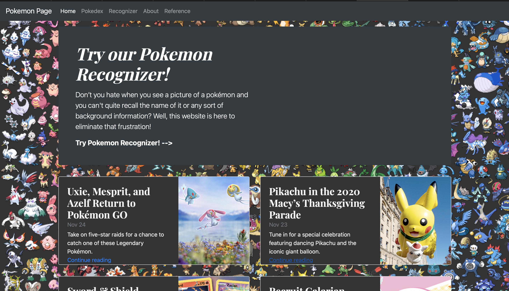
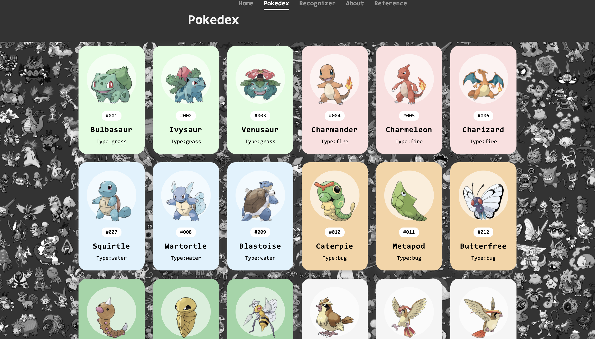
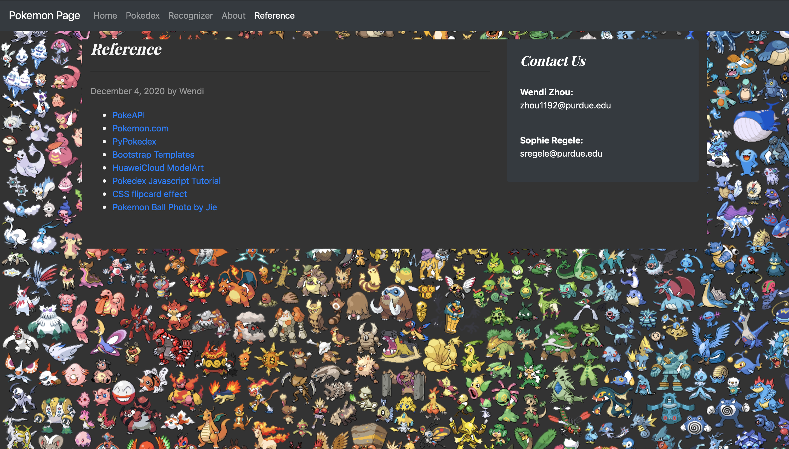

# PokemonRecognizer
Course project for CGT141
Pokemon recognizer based on Huawei Modelarts and bootstrap
Some configurations of modelArt may need some training.
under the python folder, run 'flask run'. If all the dependecies are satisfied this website should be able to visit locally.
###priview images for the website

